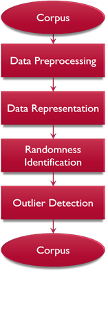

# Discovering-Surprising-Articles
Discovering Surprisimg Articles from a collection of more than 10,000 articles related to Diabetes

Introduction
When a person reads the article, he/she has some expectations on what information they would be getting to know in a particular article.
This expectation usually differs from person to person based on the domain knowledge they have. 
When something appears on the article which is deviated from the readers expectation it is considered a surprise. 
The main objective of this project is to find that element of surprise amongst a set of 10000 articles related to health information mainly diabetes which is obtained using a set of machine learning algorithms.
The final outcome is evaluated with the help of a user survey targeting the users with basic domain knowledge.

Problem Statement

Identify “surprising” news from a news corpus. “Surprise” is defined as a divergence from an expectation or a low likelihood of an occurrence according to an expected likelihood. 
Surprise might be general to society or personalized. 
General surprise is something that violates the common knowledge of the entire society whereas personalized surprise is just for a person based on this person’s background knowledge.
Personalized surprise is not necessarily surprising to society.

Sub Tasks

•	Choose one type of surprise you want to work with: general or personalized.
•	Construct a working definition of the surprise for your project. That means you need to define expectation, divergence, or expected likelihood.
•	Develop one computational approach to find surprising news in the corpus of diabetes news.
•	Conduct some evaluations (without users or with users).

What is a surprise?

•	We define the surprise in an article based on the randomness of a topic in the article.
•	Articles with high randomness have higher chance to be surprising.
•	To measure the surprise in these articles, we need to calculate the entropies.

